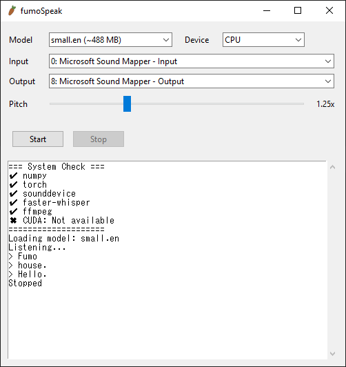

# fumoSpeak
Fumo Speech-To-Text-To-Speech: convert your voice to fumo speak (fumoTTS)


## Usage
fumoSpeak was originally intended to be used for Discord calls by installing a Virtual Audio Device source such as [VB-CABLE](https://vb-audio.com/Cable/index.htm) and selecting it as the `output` in fumoSpeak. It can however be used for general purposes as well such as [testing](#testing) playback to your speakers and different whisper models, etc.

# Requirements
fumoSpeak requires the following system dependencies:
- Python 3.10+
- [FFmpeg](https://ffmpeg.org/) (audio processing)

## Install FFmpeg
Windows (Winget) or manually from the [official site](https://ffmpeg.org/)
```bash
winget install Gyan.FFmpeg
```

Ubuntu/Debian:
```bash
sudo apt install ffmpeg
```
Mac:
```bash
brew install ffmpeg
```

# Installation
## 1. Clone this repo
```bash
git clone https://github.com/ikin-dev/fumoSpeak.git
cd fumoSpeak
```

## 2. Create a Python venv
Windows:
```bash
python -m venv venv
venv\Scripts\activate
```

Mac/Linux:
```bash
python -m venv venv
source venv/bin/activate
```

## 3. Install dependencies
```bash
pip install -r requirements.txt
```

### Optional: CUDA (GPU acceleration support)
If you want to use CUDA for faster processing, you can install the CUDA PyTorch library:
```bash
pip uninstall torch -y
pip install torch --index-url https://download.pytorch.org/whl/cu128
```

## 4. Run fumoSpeak
After installing all the dependencies, you can run the `main.py` normally:
```bash
python main.py
```

# Troubleshooting
### When choosing a model fumoSpeak freezes
Changing models automatically starts the download of the model selected and fumoSpeak will freeze during the download, these can vary in size (from 75MB to 1.5GB and above). 

### Transcription error: Library cublas64_12.dll is not found or cannot be loaded

This means that CUDA is not supported or the PyTorch library is not installed. Check the [Optional Installation](#optional-cuda-gpu-acceleration-support) step.

### No audio input detected
- Check microphone permissions and verify correct input device selected.
### No output sound
- Ensure correct output device is selected. Additionally try stopping and restarting session

# Testing
You can use the `test.py` for testing out the TTS engine. It has been rewritten for Python from JavaScript [fumoTTS](https://github.com/ikin-dev/fumottsbot/)
```bash
python test.py
```